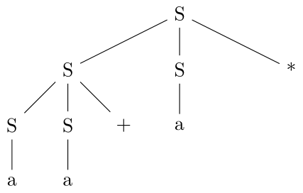

### a)

1. `a` is `S` because `S -> a`,
2. `aa+` is `S` because `a` is `S` and `S -> S S +`,
3. `aa+a*` is `S` because `aa+` is `S`, `a` is S and `S -> S S *`.

### b)

### c)

L = {postfix expression consisting of `a`'s, `+` and `*` signs}.
