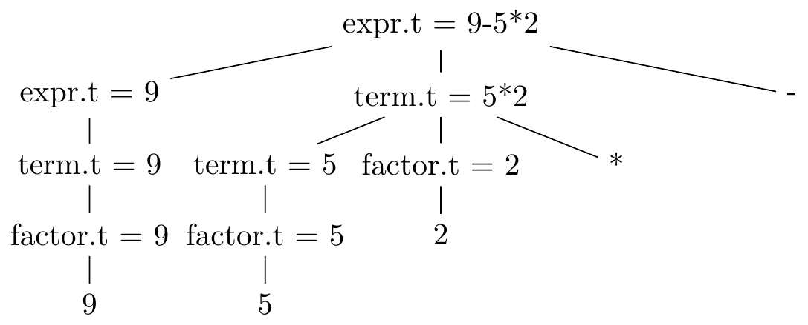

# 2.3 Syntax-Directed Translation

## Exercise 2.3.1
Construct a syntax-directed translation scheme that translates
arithmetic expressions from infix notation into prefix notation in which an
operator appears before its operands; e.g., `-xy` is the prefix notation for
`x-y`. Give annotated parse trees for the inputs `9-5+2` and `9-5*2`.

**Answer:**
```
expr -> {print('+')} expr + term
      | {print('-')} expr - term
      | term
term -> {print('*')} term * factor
      | {print('/')} term / factor
      | factor
factor -> {print('0')} 0
        | {print('1')} 1
        ...
        | {print('9')} 9
        | ( expr )
```

Annotated parse tree for `9-5+2`


Annotated parse tree for `9-5*2`


## Exercise 2.3.2
Construct a syntax-directed translation scheme that translates
arithmetic expressions from postfix notation into infix notation. Give
annotated parse trees for the inputs `95-2*` and `952*-`.

**Answer:**
```
expr -> expr {print('+')} term +
      | expr {print('-')} term -
      | term
term -> term {print('*')} factor *
      | term {print('/')} factor /
      | factor
factor -> 0 {print('0')}
        | 1 {print('1')}
        ...
        | 9 {print('9')}
        | {print('(')} expr {print(')')}
```

Annotated parse tree for `95-2*`


Annotated parse tree for `952*-`



## Exercise 2.3.3
Construct a syntax-directed translation scheme that translates integers into
roman numerals.

**Answer:**
```
int -> thousands hundreds tens ones | nz_hundreds tens ones | nz_tens ones | ones
nz_ones -> 1 {print('I')}
         | 2 {print('II')}
         | 3 {print('III')}
         | 4 {print('IV')}
         | 5 {print('V')}
         | 6 {print('VI')}
         | 7 {print('VII')}
         | 8 {print('VIII')}
         | 9 {print('IX')}
ones -> 0 | nz_ones
nz_tens -> | 1 {print('X')}
           | 2 {print('XX')}
           | 3 {print('XXX')}
           | 4 {print('XL')}
           | 5 {print('L')}
           | 6 {print('LX')}
           | 7 {print('LXX')}
           | 8 {print('LXXX')}
           | 9 {print('XC')}
tens -> 0 | nz_tens
nz_hundreds -> 1 {print('C')}
             | 2 {print('CC')}
             | 3 {print('CCC')}
             | 4 {print('CD')}
             | 5 {print('D')}
             | 6 {print('DC')}
             | 7 {print('DCC')}
             | 8 {print('DCCC')}
             | 9 {print('CM')}
hundreds -> 0 | nz_hundreds
thousands -> 1 {print('M')}
           | 2 {print('MM')}
           | 3 {print('MMM')}
```

## Exercise 2.3.4
Construct a syntax-directed translation scheme that translated roman
numerals up to 2000 into integers.

**Answer:**
```
romans -> thousands all_hundreds all_tens all_ones {print(tmp)}
ones -> ϵ
      | I {tmp += 1}
      | II {tmp += 2}
      | III {tmp += 3}
all_ones -> ones
          | IV {tmp += 4}
          | V ones {tmp += 5}
          | IX {tmp += 9}
tens -> ϵ
      | X {tmp += 10}
      | XX {tmp += 20}
      | XXX {tmp += 30}
all_tens -> tens
          | XL {tmp += 40}
          | L tens {tmp += 50}
          | XC {tmp += 90}
hundreds -> ϵ
          | C {tmp += 100}
          | CC {tmp += 200}
          | CCC {tmp += 300}
all_hundreds -> hundreds
              | CD {tmp += 400}
              | D hundreds {tmp += 500}
              | CM {tmp += 900}
thousands -> ϵ
           | M {tmp += 1000}
```

## Exercise 2.3.5
Construct a syntax-directed translation scheme to translate
postfix arithmetic expressions into equivalent prefix arithmetic
expressions.

**Answer:**
```
expr -> {print('*')} expr expr *
      | {print{'/')} expr expr /
      | {print('+')} expr expr +
      | {print('-')} expr expr -
      | digit
digit -> 0 {print('0')}
       | 1 {print('1')}
       ...
       | 9 {print('9')}
```
