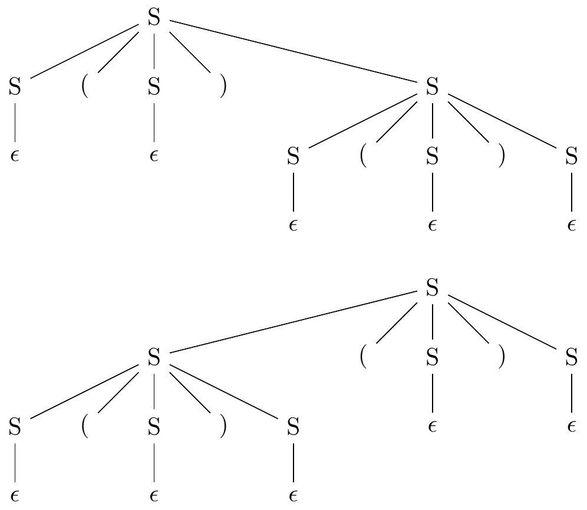
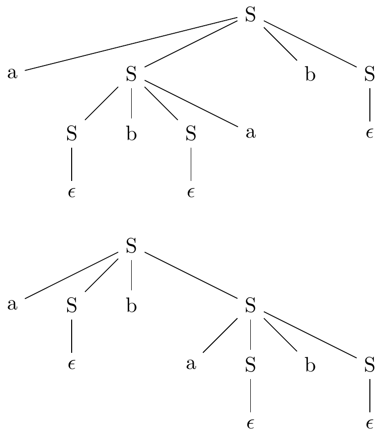

## Chapter 2 A Simple One-Pass Compiler

Exercises:

*2.1* Consider the context-free grammar `S -> S S + | S S * | a`

a) Show how the string `aa+a*` can be generated by this grammar.
1. `a` is `S` because `S -> a`,
2. `aa+` is `S` because `a` is `S` and `S -> S S +`,
3. `aa+a*` is `S` because `aa+` is `S`, `a` is S and `S -> S S *`.

b) Construct a parse tree for this string.


c) What language is generated by this grammar? Justify your answer.
L = {postfix expression consisting of `a`'s, `+` and `*` signs}.

* [2.2](./2.2/2.2.md)
* [2.3](./2.3/2.3.md)

*2.2* What language is generated by the following grammars?
In each case justify your answer.

a) `S -> 0 S 1 | 0 1`

L = {0<sup>n</sup> 1<sup>n</sup>, where n >= 1}.

b) `S -> + S S | - S S | a`

L = {prefix notation consisting of `a`'s, + and - signs}.

c) `S -> S ( S ) S | ϵ`

L = {matched brackets of arbitrary amount and nesting, includes empty string}.

d) `S -> a S b S | b S a S | ϵ`

L = {All strings of `a`'s and `b`'s that have the same amount of `a`'s and `b`'s, includes empty string}.

e) `S -> a | S + S | S S | S * | ( S )`

L = {Regular expression to describe [regular language](https://en.wikipedia.org/wiki/Regular_language)}.

*2.3* Which of the grammars in Exercise 2.2 are ambiguous?

a) No.
b) No.
c) Yes. For example: "()()".

d) Yes. For example: "abab".

e) Yes. For example: "aaa".


*2.4* Construct unambiguous context-free grammars for each of the following
languages. In each case show that your grammar is correct.

a) Arithmetic expressions in postfix notation.
`expr -> num | expr num - | expr num + | expr num * | expr num /`

b) Left-assosiative lists of identifiers separated by commas.

`list -> list, id | id`

c) Right-associative lists of identifiers separated by commas.

`list -> id, list | id`

d) Arithmetic expressions of integers and identifiers with the four binary
operators +, -, *, /.

```
expr -> expr + term | expr - term | term
term -> term * factor | term / factor | factor
factor -> num | id | ( expr )
```

e) Add unary plus and minus to the arithmetic operators of (d)

```
expr -> expr + term | expr - term | term
term -> term * unary | term / unary | unary
unary -> - factor | + factor | factor
factor -> num | id | ( expr )
```

*2.6* Construct a conext-free grammar for roman numerals.

```
ones -> I | II | III | ϵ
all_ones -> ones | IV | V ones | IX | ϵ
tens -> X | XX | XXX | ϵ
all_tens -> tens | XL | L tens | XC | ϵ
hundreds -> C | CC | CCC | ϵ
all_hundreds -> hundreds | CD | D hundreds | MC | ϵ
thousands -> M | MM | MMM | ϵ

romans -> thousands all_hundreds all_tens all_ones
```

*2.7* Construct a syntax-directed translation scheme that translates arithmetic
expressions from infix notation into postfix notation in which an operator
appears before its operands; e.g., `-xy` is the pregix notation for `x-y`.
Give annotated parse trees for the inputs `9-5+2` and `9-5*2`.