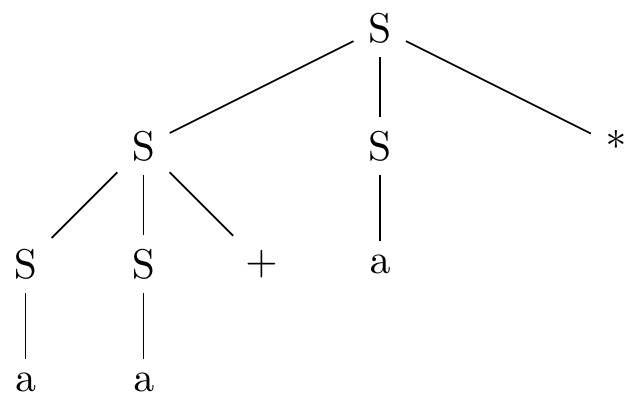
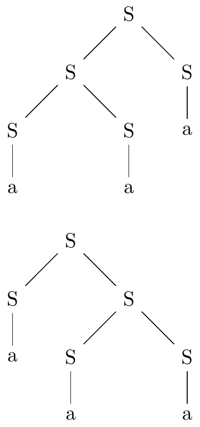
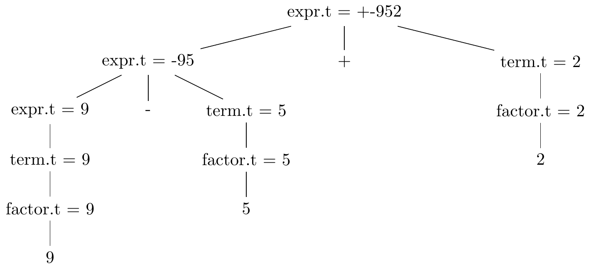
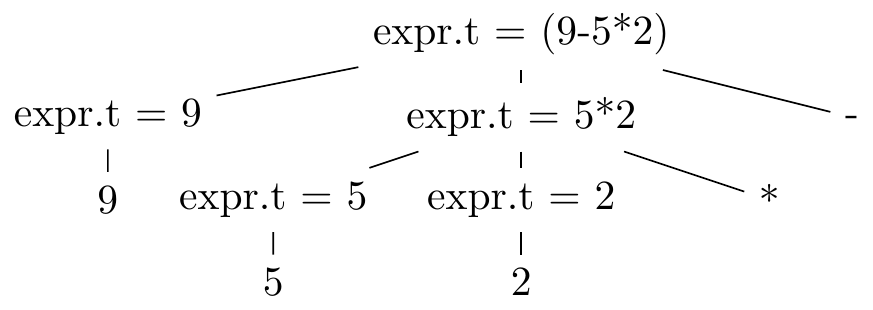

# Chapter 2, A Simple One-Pass Compiler

## 2.1
Consider the context-free grammar `S -> S S + | S S * | a`

a) Show how the string `aa+a*` can be generated by this grammar.
1. `a` is `S` because `S -> a`,
2. `aa+` is `S` because `a` is `S` and `S -> S S +`,
3. `aa+a*` is `S` because `aa+` is `S`, `a` is `S` and `S -> S S *`.

b) Construct a parse tree for this string.



c) What language is generated by this grammar? Justify your answer.

L = {postfix expression consisting of `a`s, `+` and `*` signs}.

## 2.2
What language is generated by the following grammars?
In each case justify your answer.

a) `S -> 0 S 1 | 0 1`

L = {0<sup>n</sup> 1<sup>n</sup>, where n >= 1}.

b) `S -> + S S | - S S | a`

L = {prefix notation consisting of `a`s, `+` and `-` signs}.

c) `S -> S ( S ) S | ϵ`

L = {matched brackets of arbitrary amount and nesting, includes empty string}.

d) `S -> a S b S | b S a S | ϵ`

L = {All strings of `a`s and `b`s that have the same amount of `a`s and
     `b`s, includes empty string}.

e) `S -> a | S + S | S S | S * | ( S )`

L = {Regular expression to describe
     [regular language](https://en.wikipedia.org/wiki/Regular_language)}.

## 2.3
Which of the grammars in Exercise 2.2 are ambiguous?

a) No.

b) No.

c) Yes. For example: "()()".


d) Yes. For example: "abab".


e) Yes. For example: "aaa".



## 2.4
Construct unambiguous context-free grammars for each of the following
languages. In each case show that your grammar is correct.

a) Arithmetic expressions in postfix notation.
`expr -> num | expr expr - | expr expr + | expr expr * | expr expr /`

b) Left-assosiative lists of identifiers separated by commas.

`list -> list, id | id`

c) Right-associative lists of identifiers separated by commas.

`list -> id, list | id`

d) Arithmetic expressions of integers and identifiers with the four binary
operators +, -, *, /.

```
expr -> expr + term | expr - term | term
term -> term * factor | term / factor | factor
factor -> num | id | ( expr )
```

e) Add unary plus and minus to the arithmetic operators of (d)

```
expr -> expr + term | expr - term | term
term -> term * unary | term / unary | unary
unary -> - factor | + factor | factor
factor -> num | id | ( expr )
```

## 2.5
a) Show that all binary strings generated by the following grammar have values
divisible by 3. *Hint.* Use induction on the number of nodes in a parse tree.

`num -> 11 | 1001 | num  0 | num num`

b) Does the grammar generate all binary strings with values divisible by 3?

No. For example, `21 = 10101` is divisible by 3 but cannot be generated by
the grammar.

## 2.6
Construct a conext-free grammar for roman numerals.

```
ones -> I | II | III | ϵ
all_ones -> ones | IV | V ones | IX
tens -> X | XX | XXX | ϵ
all_tens -> tens | XL | L tens | XC
hundreds -> C | CC | CCC | ϵ
all_hundreds -> hundreds | CD | D hundreds | CM
thousands -> M | MM | MMM | ϵ

romans -> thousands all_hundreds all_tens all_ones
```

## 2.7
Construct a syntax-directed translation scheme that translates
arithmetic expressions from infix notation into postfix notation in which an
operator appears before its operands; e.g., `-xy` is the pregix notation for
`x-y`. Give annotated parse trees for the inputs `9-5+2` and `9-5*2`.

Production              | Translation Scheme
------------------------|-------------------
`expr -> expr + term`   | `{print('+')} expr -> expr + term`
`expr -> expr - term `  | `{print('-')} expr -> expr - term `
`expr -> term`          | `expr -> term`
`term -> term * factor` | `{print('*')} term -> term * factor`
`term -> term / factor` | `{print('/')} term -> term / factor`
`term -> factor`        | `term -> factor`
`factor -> 0`           | `{print('0')} 0`
`factor -> 1`           | `{print('1')} 1`
...                     | ...
`factor -> 9`           | `{print('9')} 9`
`factor -> ( expr )`    | `expr`

Annotated parse tree for `9-5+2`



Annotated parse tree for `9-5*2`


## 2.8
Construct a syntax-directed translation scheme that translates
arithmetic expressions from postfix natation into infix natation. Give
annotated parse trees for the inputs `95-2*` and `952*-`.

Production            | Translation Scheme
----------------------|--------------------
`expr -> 0`           | `{print('0')} 0`
`expr -> 1`           | `{print('1')} 1`
...                   | ...
`expr -> 9`           | `{print('9')} 9`
`expr -> expr expr -` | `expr {print('-')} expr -`
`expr -> expr expr +` | `expr {print('-')} expr +`
`expr -> expr expr *` | `{print('(')} expr {print(')*(')} expr {print(')')} *`
`expr -> expr expr /` | `{print('(')} expr {print(')/(')} expr {print(')')} /`

Annotated parse tree for `95-2*`


Annotated parse tree for `952*-`



## 2.9
Construct a syntax-directed translator that translates integers into
roman numerals.

Production                            | Translation Scheme
--------------------------------------|-------------------
`ones -> 0`                           | `ones -> 0`
`ones -> 1`                           | `ones -> 1 {print('I')}`
`ones -> 2`                           | `ones -> 2 {print('II')}`
`ones -> 3`                           | `ones -> 3 {print('III')}`
`ones -> 4`                           | `ones -> 4 {print('IV')}`
`ones -> 5`                           | `ones -> 5 {print('V')}`
`ones -> 6`                           | `ones -> 6 {print('VI')}`
`ones -> 7`                           | `ones -> 7 {print('VII')}`
`ones -> 8`                           | `ones -> 8 {print('VIII')}`
`ones -> 9`                           | `ones -> 9 {print('IX')}`
`tens -> ϵ`                           | `tens -> ϵ`
`tens -> 0`                           | `tens -> 0`
`tens -> 1`                           | `tens -> 1 {print('X')}`
`tens -> 2`                           | `tens -> 2 {print('XX')}`
`tens -> 3`                           | `tens -> 3 {print('XXX')}`
`tens -> 4`                           | `tens -> 4 {print('XL')}`
`tens -> 5`                           | `tens -> 5 {print('L')}`
`tens -> 6`                           | `tens -> 6 {print('LX')}`
`tens -> 7`                           | `tens -> 7 {print('LXX')}`
`tens -> 8`                           | `tens -> 8 {print('LXXX')}`
`tens -> 9`                           | `tens -> 9 {print('XC')}`
`hundreds -> ϵ`                       | `hundreds -> ϵ`
`hundreds -> 0`                       | `hundreds -> 0`
`hundreds -> 1`                       | `hundreds -> 1 {print('C')}`
`hundreds -> 2`                       | `hundreds -> 2 {print('CC')}`
`hundreds -> 3`                       | `hundreds -> 3 {print('CCC')}`
`hundreds -> 4`                       | `hundreds -> 4 {print('CD')}`
`hundreds -> 5`                       | `hundreds -> 5 {print('D')}`
`hundreds -> 6`                       | `hundreds -> 6 {print('DC')}`
`hundreds -> 7`                       | `hundreds -> 7 {print('DCC')}`
`hundreds -> 8`                       | `hundreds -> 8 {print('DCCC')}`
`hundreds -> 9`                       | `hundreds -> 9 {print('CM')}`
`thousands -> ϵ`                      | `thousands -> ϵ`
`thousands -> 1`                      | `thousands -> 1 {print('M')}`
`thousands -> 2`                      | `thousands -> 2 {print('MM')}`
`thousands -> 3`                      | `thousands -> 3 {print('MMM')}`
`int -> thousands hundreds tens ones` | `int -> thousands hundreds tens ones`

## 2.10
Construct a syntax-directed translation scheme that translated roman
numerals into integers.

Production                   | Translation Scheme
-----------------------------|-------------------
`ones -> ϵ`                  | `ones -> ϵ`
`ones -> I`                  | `ones -> I {tmp += 1}`
`ones -> II`                 | `ones -> II {tmp += 2}`
`ones -> III`                | `ones -> III {tmp += 3}`
`all_ones -> ones`           | `all_ones -> ones`
`all_ones -> IV`             | `all_ones -> IV {tmp += 4}`
`all_ones -> `V ones`        | `all_ones -> `V ones {tmp += 5}`
`all_ones -> IX`             | `all_ones -> IX {tmp += 9}`
`tens -> ϵ`                  | `tens -> ϵ`
`tens -> X`                  | `tens -> X {tmp += 10}`
`tens -> XX`                 | `tens -> XX {tmp += 20}`
`tens -> XXX`                | `tens -> XXX {tmp += 30}`
`all_tens -> tens`           | `all_tens -> tens`
`all_tens -> XL`             | `all_tens -> XL {tmp += 40}`
`all_tens -> L tens`         | `all_tens -> L tens {tmp += 50}`
`all_tens -> XC`             | `all_tens -> XC {tmp += 90}`
`hundreds -> ϵ`              | `hundreds -> ϵ`
`hundreds -> C`              | `hundreds -> C {tmp += 100}`
`hundreds -> CC`             | `hundreds -> CC {tmp += 200}`
`hundreds -> CCC`            | `hundreds -> CCC {tmp += 300}`
`all_hundreds -> hundreds`   | `all_hundreds -> hundreds`
`all_hundreds -> CD`         | `all_hundreds -> CD {tmp += 400}`
`all_hundreds -> D hundreds` | `all_hundreds -> D hundreds {tmp += 500}`
`all_hundreds -> MC`         | `all_hundreds -> MC {tmp += 900}`
`thousands -> ϵ`             | `thousands -> ϵ`
`thousands -> M`             | `thousands -> M {tmp += 1000}`
`thousands -> MM`            | `thousands -> MM {tmp += 2000}`
`thousands -> MMM`           | `thousands -> MMM {tmp += 3000}`
`romans -> thousands all_hundreds all_tens all_ones` |`romans -> thousands all_hundreds all_tens all_ones {print(tmp)}`
