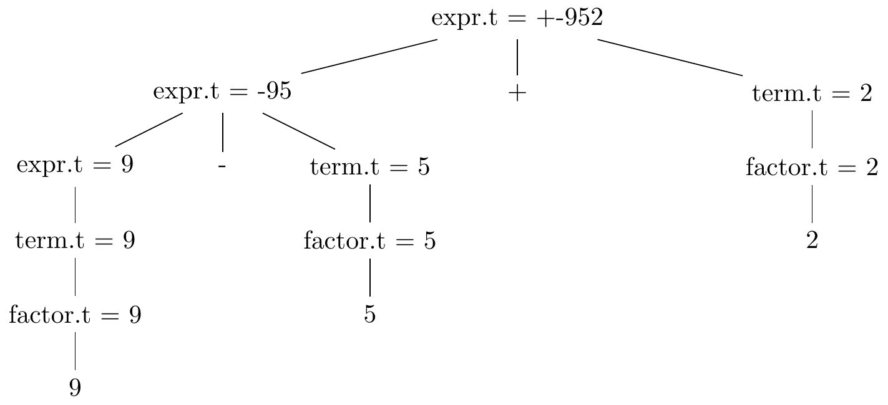
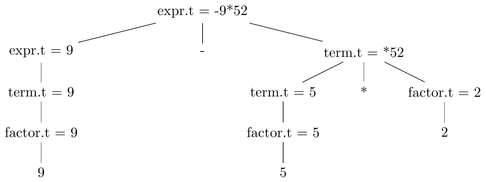
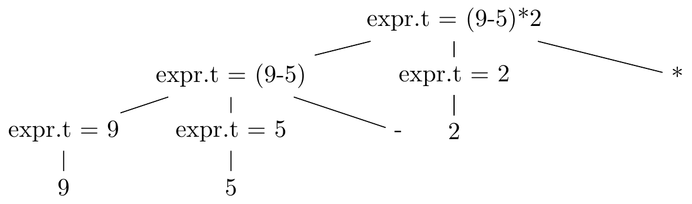
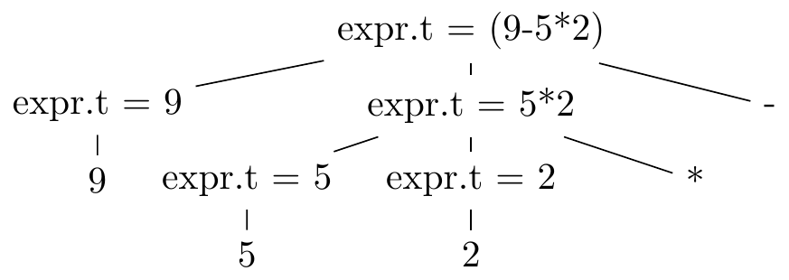

# 2.3 Syntax-Directed Translation

## Exercise 2.3.1
Construct a syntax-directed translation scheme that translates
arithmetic expressions from infix notation into prefix notation in which an
operator appears before its operands; e.g., `-xy` is the prefix notation for
`x-y`. Give annotated parse trees for the inputs `9-5+2` and `9-5*2`.

```
expr -> {print('+')} expr + term
expr -> {print('-')} expr - term
expr -> term
term -> {print('*')} term * factor
term -> {print('/')} term / factor
term -> factor
factor -> {print('0')} 0
factor -> {print('1')} 1
...
factor -> {print('9')} 9
factor -> ( expr )
```

Annotated parse tree for `9-5+2`



Annotated parse tree for `9-5*2`



## Exercise 2.3.2
Construct a syntax-directed translation scheme that translates
arithmetic expressions from postfix notation into infix notation. Give
annotated parse trees for the inputs `95-2*` and `952*-`.

```
expr -> expr {print('*')} expr *
expr -> expr {print{'/')} expr /
expr -> {print('(')} expr {print('+')} expr {print(')')} +
expr -> {print('(')} expr {print('-')} expr {print(')')} -
expr -> 0 {print('0')}
expr -> 1 {print('1')}
...
expr -> 9 {print('9')}
```

Annotated parse tree for `95-2*`



Annotated parse tree for `952*-`



## Exercise 2.3.3
Construct a syntax-directed translation scheme that translates integers into
roman numerals.

```
ones -> 0
ones -> 1 {print('I')}
ones -> 2 {print('II')}
ones -> 3 {print('III')}
ones -> 4 {print('IV')}
ones -> 5 {print('V')}
ones -> 6 {print('VI')}
ones -> 7 {print('VII')}
ones -> 8 {print('VIII')}
ones -> 9 {print('IX')}
tens -> 0
tens -> 1 {print('X')}
tens -> 2 {print('XX')}
tens -> 3 {print('XXX')}
tens -> 4 {print('XL')}
tens -> 5 {print('L')}
tens -> 6 {print('LX')}
tens -> 7 {print('LXX')}
tens -> 8 {print('LXXX')}
tens -> 9 {print('XC')}
hundreds -> 0
hundreds -> 1 {print('C')}
hundreds -> 2 {print('CC')}
hundreds -> 3 {print('CCC')}
hundreds -> 4 {print('CD')}
hundreds -> 5 {print('D')}
hundreds -> 6 {print('DC')}
hundreds -> 7 {print('DCC')}
hundreds -> 8 {print('DCCC')}
hundreds -> 9 {print('CM')}
thousands -> ϵ
thousands -> 1 {print('M')}
thousands -> 2 {print('MM')}
thousands -> 3 {print('MMM')}
int -> thousands hundreds tens ones | tens ones | ones
```

## Exercise 2.3.4
Construct a syntax-directed translation scheme that translated roman
numerals up to 2000 into integers.

```
ones -> ϵ
ones -> I {tmp += 1}
ones -> II {tmp += 2}
ones -> III {tmp += 3}
all_ones -> ones
all_ones -> IV {tmp += 4}
all_ones -> V ones {tmp += 5}
all_ones -> IX {tmp += 9}
tens -> ϵ
tens -> X {tmp += 10}
tens -> XX {tmp += 20}
tens -> XXX {tmp += 30}
all_tens -> tens
all_tens -> XL {tmp += 40}
all_tens -> L tens {tmp += 50}
all_tens -> XC {tmp += 90}
hundreds -> ϵ
hundreds -> C {tmp += 100}
hundreds -> CC {tmp += 200}
hundreds -> CCC {tmp += 300}
all_hundreds -> hundreds
all_hundreds -> CD {tmp += 400}
all_hundreds -> D hundreds {tmp += 500}
all_hundreds -> MC {tmp += 900}
thousands -> ϵ
thousands -> M {tmp += 1000}
thousands -> MM {tmp += 2000}
thousands -> MMM {tmp += 3000}
romans -> thousands all_hundreds all_tens all_ones {print(tmp)}
```
